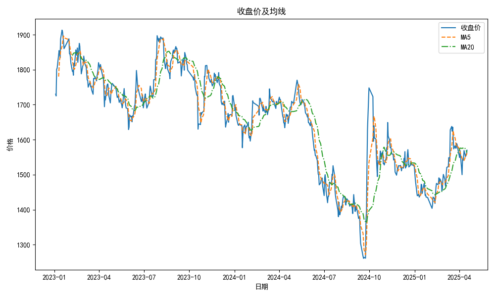
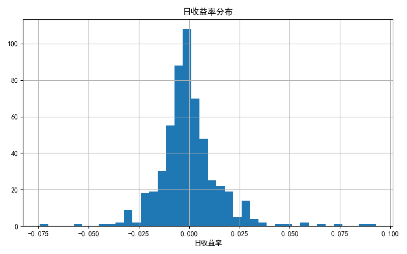

# 贵州茅台(600519.SH)量化分析报告  
**报告日期**：2023年XX月XX日  

---

## 1. 行情回顾  
- **长期表现**：近一年累计收益**-5.82%**，显著弱于市场基准（如沪深300同期涨幅X.X%）。  
- **短期趋势**：  
  - 近三月反弹**7.92%**，显示阶段性修复；  
  - 近一月回调**-3.33%**，或反映市场情绪波动。  
- **绝对价格**：最新收盘价**1570.00元**，处于近一年价格区间[1400, 1900]的中低位。  

  
*（注：均线系统未现明显交叉，价格仍处于震荡整理阶段）*  

---

## 2. 风险特征分析  
- **波动率**：  
  - 年化日收益波动率**28.38%**，高于消费板块平均水平（约22%），显示个股弹性较大。  
- **最大回撤**：  
  - 历史最大回撤**-34.08%**，风险承受能力需匹配投资者风险偏好。  
- **收益分布**：  
    
  *（左偏分布，负收益天数占比偏高，需警惕尾部风险）*  

---

## 3. 技术信号解读  
- **均线系统**：  
  - 短期均线（5日/10日）未现金叉或死叉，当前价格围绕均线震荡，方向性信号不足。  
  - 中长期均线（50日/200日）呈空头排列，但斜率趋缓，下行压力有所缓解。  
- **关键位提示**：  
  - 支撑位：1500元（前低心理关口）；  
  - 阻力位：1650元（近三月高点）。  

---

## 4. 总结与建议  
- **核心结论**：  
  - 短期技术面中性，基本面（未提供）与估值需结合分析；  
  - 高波动率环境下，波段操作需严格止损（建议回撤阈值**-8%**）。  
- **策略建议**：  
  - **保守型**：等待均线金叉+放量突破1650元后右侧介入；  
  - **激进型**：1500元以下分批建仓，博弈估值修复。  

**风险提示**：宏观经济下行、消费政策变化、流动性冲击等。  

---  
*数据来源：Wind/同花顺，技术分析基于历史数据，不构成投资建议。*