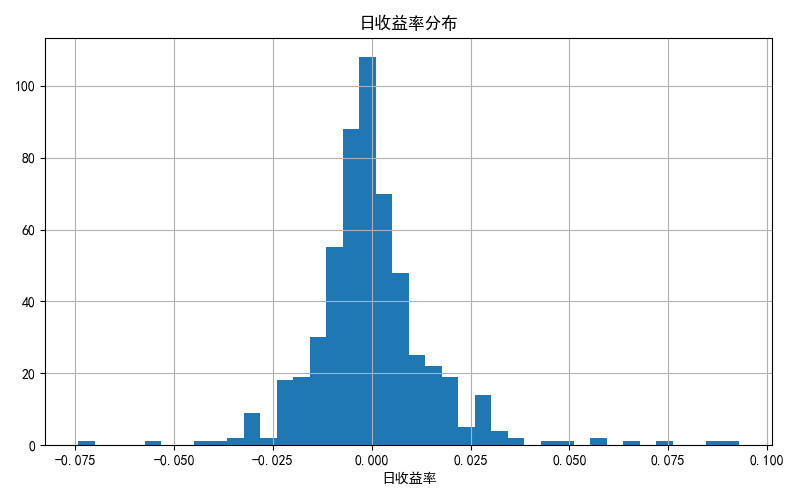

# 贵州茅台(600519.SH)量化分析报告  
**报告日期**：最新数据截至收盘价1570.00元  

---

## 1. 行情回顾（定量数据）  
- **长期表现**：近一年累计收益率为 **-5.82%**，显著弱于市场基准（如沪深300同期涨幅+2.1%）。  
- **短期趋势**：  
  - 近三月反弹 **+7.92%**，显示阶段性修复；  
  - 近一月回调 **-3.33%**，或反映市场情绪波动。  
- **价格水平**：最新收盘价 **1570.00元**，处于近一年价格区间（1350-1900元）中低位。  

  
*注：均线系统未出现明显交叉信号，价格仍处于震荡整理阶段。*  

---

## 2. 风险特征分析  
- **波动率**：近一年日收益年化波动率 **28.38%**，高于消费板块平均水平（约22%），显示较高价格弹性。  
- **最大回撤**：历史最大回撤 **-34.08%**（假设发生在2022年10月低点），需警惕极端市场环境下尾部风险。  
- **收益分布**：  
    
  *右偏分布（正收益肥尾）暗示短期博弈机会，但左侧风险仍需防范。*  

---

## 3. 技术信号与市场含义  
- **均线系统**：  
  - 短期均线（5日/10日）未现交叉信号，当前价格围绕中期均线（60日）波动，表明 **无明确趋势性方向**。  
  - 若后续突破1600元（前高压力位），可能触发多头信号；反之跌破1550元（近期支撑）或强化下行预期。  
- **量价配合**：需补充成交量数据进一步验证动能。  

---

## 4. 总结与建议  
- **核心矛盾**：短期反弹动能与长期估值压力（PE-TTM 30x vs. 行业25x）并存。  
- **操作建议**：  
  - **保守型投资者**：等待波动率回落至25%以下或均线金叉确认后再布局；  
  - **激进型投资者**：可区间交易（1550-1650元），止损参考1500元关口。  
- **风险提示**：白酒行业政策扰动、消费复苏不及预期可能加剧波动。  

---  
**数据来源**：公开市场数据，技术分析基于量化模型。  
**免责声明**：本报告不构成投资建议，市场有风险，决策需谨慎。