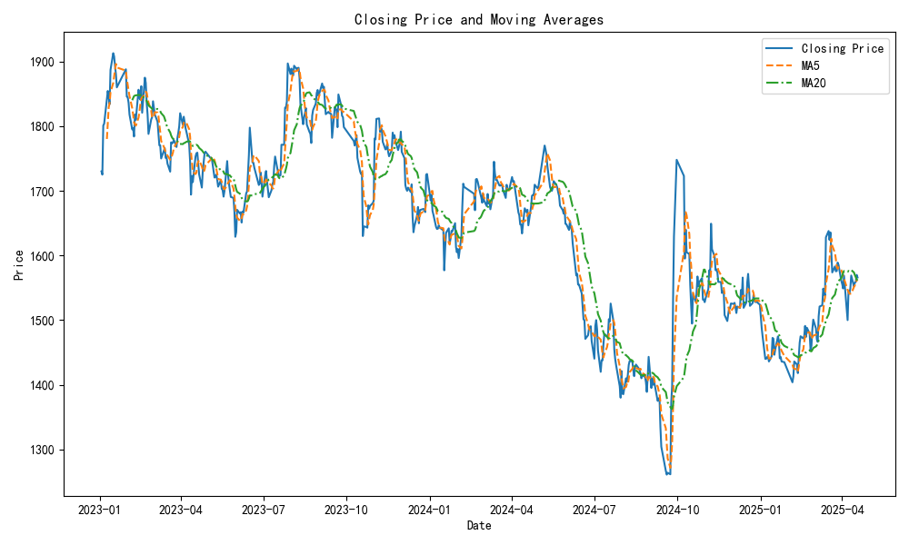
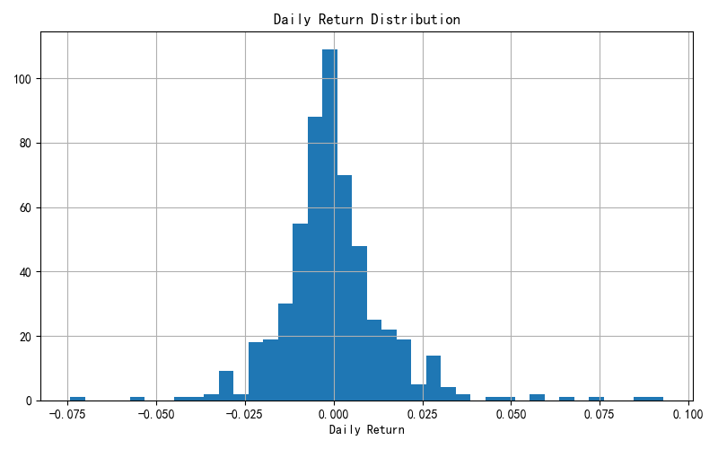

# Quantitative Financial Analysis Report for Stock Code 600519.SH

## 1. Market Review

The stock code 600519.SH has exhibited mixed performance over the past year. Below are the key quantitative metrics:

- **1-Year Price Change**: -6.27%
- **3-Month Price Change**: 6.18%
- **1-Month Price Change**: -4.27%
- **Latest Closing Price**: 1565.94 yuan

The negative 1-year price change indicates a decline in value over the longer term, while the positive 3-month change suggests a recent recovery phase. However, the 1-month decline indicates potential volatility or market correction.

## 2. Risk Characteristics

### Volatility
- **1-Year Annualized Daily Return Volatility**: 28.38%

This level of volatility suggests that the stock experiences significant price fluctuations, which may be indicative of higher risk for investors.

### Maximum Drawdown
- **Historical Maximum Drawdown**: -34.08%

The maximum drawdown reflects the largest observed loss from a peak to a trough, indicating that the stock has experienced substantial declines in the past. This level of drawdown is a critical risk factor for potential investors.

## 3. Technical Indicators/Signals

### Moving Average Signal Analysis
- **Moving Average Crossover Signals**: No significant moving average crossover signals observed.

The absence of significant moving average crossovers suggests a lack of clear bullish or bearish momentum signals in the short to medium term. This may indicate a period of consolidation or indecision in the market.

## 4. Additional Summary Recommendations

Based on the analysis of the stock code 600519.SH, the following recommendations are made:

- **Caution Advised**: Given the negative 1-year price change and high volatility, investors should exercise caution when considering new positions in this stock.
- **Monitor for Recovery**: The recent positive 3-month price change may indicate a potential recovery. Investors should monitor this trend closely for signs of sustained upward momentum.
- **Risk Management**: Due to the historical maximum drawdown of -34.08%, it is advisable for investors to implement robust risk management strategies, including stop-loss orders or position sizing, to mitigate potential losses.
- **Technical Analysis**: Continue to observe moving averages for any future crossover signals that may provide clearer entry or exit points.

In conclusion, while the stock has shown some short-term recovery, the overall risk profile suggests that investors should remain vigilant and consider their risk tolerance before making investment decisions.