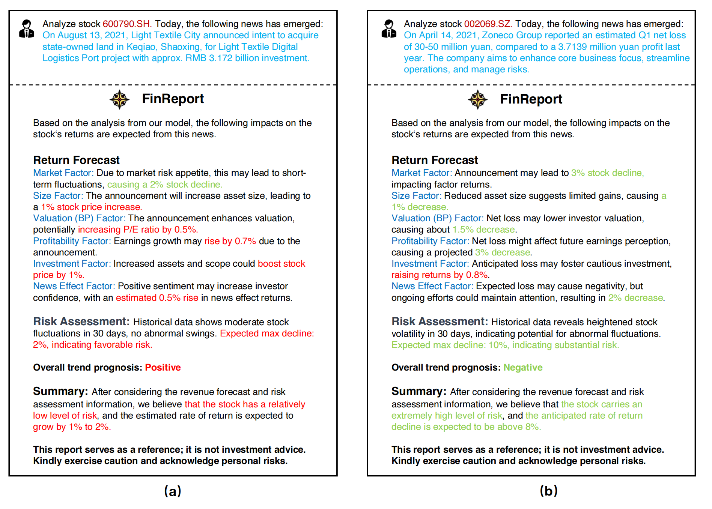

# 基于Langchain的金融Agent系统
## 1. 系统架构设计
### 1.1 Q&A System
    直接用langchain chatchat项目即可
    也可以在本地部署一个很菜的LLM然后用强化学习改进
### 1.2 Chatbot
    已经写好调用API的Chatbot
### 1.3 Financial Agent
    已经写好一个非常简陋的Financial Agent,对于美股数据进行爬取，但是最好建议预先爬取好相当一部分数据集

### 1.4 主要贡献分析
Q&A system: 在现有开源可以商用框架langchain chat chat的性能优秀的前提下，我们的贡献是测试不同LLM的性能，分析基于API，基于量化部署的可行性以及可用性。
此外，我们还可以继续沿用强化学习改进RAG的性能的框架，并且justify说我们设计了两种方法，这个是第一种，优点是能显著改进小型模型的回答性能，并且节省API费用，可以在个人的PC端进行部署，算力消耗较小。
然后我们就可以过渡到langchain chat chat了，甚至可以用langchain chat chat进行部署chatbot

chatbot:
主要贡献点是测试不同LLM的chatbot的记忆，内存管理，响应速度等性能，然后要部署一个利用金融数据微调过的LLM.主要是强调通过API key调用的chatbot能检索实时的信息，聊天更具备时效性与普适性。然后部署的LLM说明是利用金融行业数据微调过的，就说能保证隐私安全，算力要求低，且面向特定领域的效果好

Agent:
主要贡献是生成一个finreport, 用LLM进行总结特定领域的研究报告。agent通过调用过去的数据和计算功能的函数实现收益预测，风险预测；通过调用情感分析函数实现新闻基本面分析，最后总结生成报告。实现了一个很新颖的pipeline.

### 1.5 总结
其实这是一个面向于实际问题的解决方案，即设计一套基于langchain的系统，这个系统能方便我们管理和部署LLM，来协助我们在金融领域提高工作效率。

个人想法是将要做的东西有机结合起来，使其成为一个能在未来可以拓展的系统。

## 2. 系统工作流程
1. 关于金融领域的知识，我们可以与chatbot进行交互，chatbot可以是通用的LLM，也可以是经过微调的面向金融的LLM(13B以内)。就说要是获取实时的信息，就可以让通用的LLM作为回答的模型，要是想保证数据的安全，隐私，同时提高特定专业领域的正确性，就可以用后者，并且后者对于计算资源的要求不算高，前者利用API就行。
2. 然后，我们想研究特定公司的金融情况，最好是美股，因为国内A股市场要想用爬虫，会遇到很多的反爬机制，并且会不会非法。或者最好用tushare以及其他现成的数据集，但是tushare的租用成本有点高。确定好公司或企业后，我们就用Financial Agent协助我们生成对应的Report,包含股票回报预测，风险分析
3. 最后，我们可以通过Langchain chatchat进行构建Q&A system,这个QA system功能已经很完备，可以实现多种文件的Q&A。即我们可以将很多的report存着，然后再后续问这个系统关于Report的问题。

## 3. 待完成的事情
（这里其实主要的是很多的测试，demo，以及agent优化，前端界面，报告，PPT）
### 3.1 Q&A System
- 在本地下载并部署一个小型的模型，然后利用langchain框架和强化学习进行改进Q&A性能,将结果展示出来
- 利用langchain chatchat进行测试不同模型的Q&A(RAG)性能，筛选出最优的模型(trade off)，利用已有的benchmark进行测试，能找到金融的最好
- 在测试不同LLM的时候最好能部署一个针对于金融领域优化的LLM
### 3.2 Chatbot
- API部署后根据文献调研的材料进行性能测试，本地部署也可以测试
- 可以尝试用langchain chatchat进行不同LLM测试
- 除了基本的记忆性测试之外，我们如果可以，还能引入金融问答进行测试，或者直接用金融问答进行测试。最后筛选出最优的：通用和金融领域的chatbot
### 3.3 Financial Agent
- 争取尽可能复现那篇论文的效果，集合更多的金融特征，使得模型能更好给出报告的结果。这里的重点不是测试不同模型，而是争取用上述比较好的模型给出一个比较好的可视化的结果
- 最后最好给chatbot, financial agent做一个前端界面。
### 3.4 Report and PRE
- 一个好看的系统架构设计图
- 上述内容涉及到的related work调研（调研的时候涉及到我们的项目要扬长避短，比如，在调研到Fin report这篇文章的时候，虽然说我们的agent是借鉴了，但是我们还做了Q&A system和RAG，还有对应的chatbot，就是强调我们的广度，而不是我们的深度。强调我们系统的全面性，商用性，可部署性而非学术性，因为时间过于紧张很难做到academic）
-  demo video
