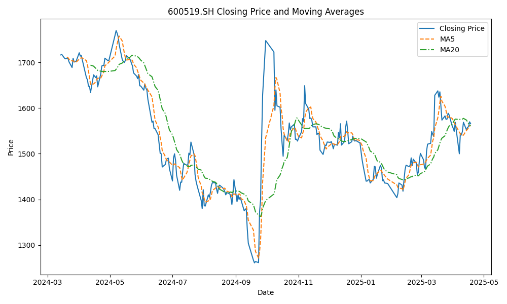
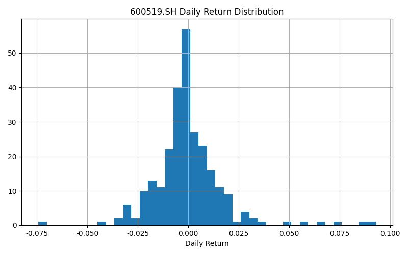

# Financial Analysis Report: 600519.SH

## 1. Market Review

The stock code 600519.SH has experienced varied price changes over different time frames. Over the past year, the stock has seen a price decrease of 6.27%. However, in the last three months, there has been a positive price change of 6.18%, indicating some recovery. The past month has been less favorable, with a price decline of 4.27%. The latest closing price stands at 1565.94 yuan.

## 2. Risk Characteristics

The stock exhibits significant risk characteristics, as evidenced by its annualized daily return volatility of 28.38%. This level of volatility suggests substantial price fluctuations, which investors should consider when assessing risk. Additionally, the historical maximum drawdown is -28.76%, indicating the largest peak-to-trough decline in the stock's value over the observed period.

## 3. Technical Indicators/Signals

Currently, there are no significant moving average crossover signals observed for 600519.SH. This lack of crossover suggests that there may not be strong directional momentum in the stock's price, and it may continue to fluctuate within its current range without a clear trend.

## 4. Recent News Analysis

The recent news article titled "胡润发布2024品牌榜：茅台品牌价值跌破万亿" highlights a significant development regarding the brand value of Guizhou Moutai. According to the 2024 Hurun Brand List, Moutai's brand value has decreased by 24%, falling below one trillion yuan for the first time since 2020, now valued at 800 billion yuan. Despite this decline, Moutai remains the most valuable Chinese brand, significantly ahead of others like Douyin and Huawei. This reduction in brand value could impact investor sentiment and potentially affect the stock's market performance.

## 5. Summary & Outlook

In summary, 600519.SH has shown mixed price performance with recent declines overshadowing short-term gains. The stock's high volatility and significant historical drawdown indicate considerable risk, which investors should weigh carefully. The absence of clear moving average signals suggests a lack of strong directional trends. Additionally, the recent decline in Moutai's brand value may influence market perceptions and investor confidence. Overall, while there are no definitive buy/sell signals, investors should remain cautious and monitor further developments closely.